# **Step-by-Step Guide to Setting Up an L4S-Enabled Linux Kernel for Experiments**

## **Step 1: Prerequisites**
Before you begin, ensure you have the following:

### **1.1 System Requirements**
- **Operating System**: Ubuntu/Debian or another Debian-based distribution is recommended.
- **Kernel Build Tools**: Install essential dependencies:
  ```bash
  sudo apt update
  sudo apt install build-essential libncurses-dev bison flex libssl-dev libelf-dev git wget unzip
  ```
- **Enough Disk Space**: Ensure at least **20GB of free disk space** for compiling the kernel.
- **Stable Internet Connection**: Required to download the kernel source and dependencies.

### **1.2 Identify Your Network Interface Name**
Newer Linux distributions use **Predictable Network Interface Names** instead of `eth0`. To find your correct interface name, run:
```bash
ip link show
```
Look for an interface like `eno1`, `ens33`, or `eth0`. Use this correct name in later steps.

---
### **1.3 iperf3 Flags Reference Table for L4S Testing**

| Flag       | Description                                   | Purpose in L4S Testing                                                                 | Example Usage                          |
|------------|----------------------------------------------|---------------------------------------------------------------------------------------|----------------------------------------|
| `-c`       | Client mode (specify server IP)              | Connect to an L4S-enabled server for testing                                          | `iperf3 -c <server-ip>`           |
| `-s`       | Server mode                                  | Start an iperf3 server to receive L4S traffic                                         | `iperf3 -s -p 5201`                   |
| `-Z`       | Zerocopy      | NA                        | `iperf3 -c <server-ip> -Z`           |
| `-t`       | Test duration (seconds)                      | Define how long to run the test (e.g., for stability checks)                          | `iperf3 -c <server-ip> -t 60`     |
| `-i`       | Interval (seconds) between periodic reports  | Monitor throughput/latency trends over time                                           | `iperf3 -c <server-ip> -i 5`      |
| `-V`       | Verbose output                               | Show detailed connection info (e.g., ECN negotiation)                                 | `iperf3 -c <server-ip> -V`        |
| `-p`       | Server port (default: 5201)                  | Change port if default is blocked or for multi-server tests                           | `iperf3 -c <server-ip> -p 5202`     |
| `-u`       | UDP mode (instead of TCP)                    | Test latency/jitter without congestion control (rare for L4S)                         | `iperf3 -c <server-ip> -u -b 1G`    |
| `-b`       | Bandwidth limit (e.g., 100M for 100 Mbps)    | Simulate constrained networks (useful for L4S vs. Cubic comparisons)                   | `iperf3 -c <server-ip> -b 100M`  |
| `-R`       | Reverse mode (server sends data to client)   | Test asymmetric paths (e.g., NAT/firewall issues)                                     | `iperf3 -c <server-ip> -R`       |
| `-J`       | JSON output (machine-readable)               | Integrate results into monitoring tools                                               | `iperf3 -c <server-ip> -J`       |
| `--logfile`| Save output to a file                        | Record test results for analysis                                                      | `iperf3 -c <server-ip> --logfile l4s_test.txt` |


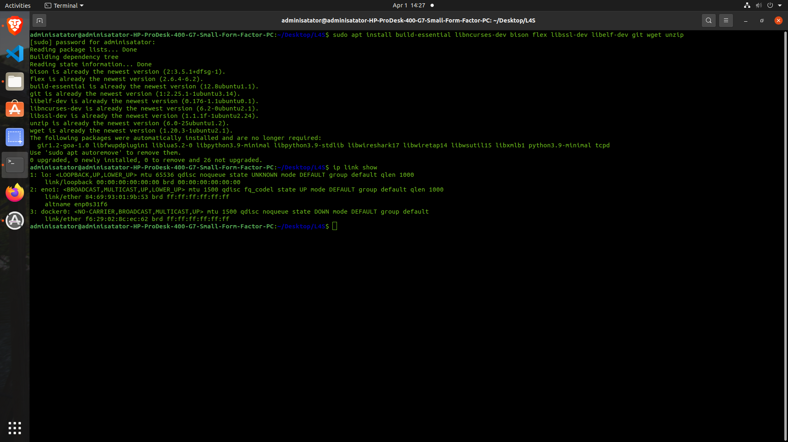


## **Step 2: Install the Pre-Built L4S Kernel**
Instead of compiling the kernel manually, you can install a **pre-built** kernel.

1. **Download the Pre-Built Kernel Packages**
   ```bash
   wget https://github.com/L4STeam/linux/releases/download/testing-build/l4s-testing.zip
   ```
2. **Extract the Kernel Package**
   ```bash
   unzip l4s-testing.zip
   ```
3. **Install the Kernel**
   ```bash
   sudo dpkg --install debian_build/*
   ```
4. **Update GRUB Bootloader**
   ```bash
   sudo update-grub
   ```
5. **Reboot into the New Kernel**
   ```bash
   sudo reboot
   ```
6. **Verify the Installed Kernel**
   After rebooting, ensure you are running the new L4S kernel:
   ```bash
   uname -r
   ```


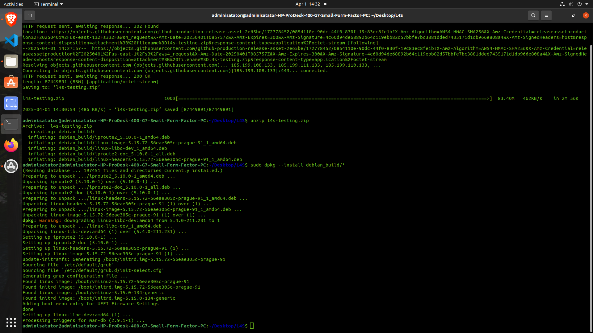

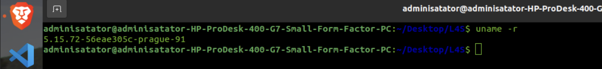


---

## **Step 3: Load Required Kernel Modules**
L4S requires specific kernel modules. Load them manually:

```bash
sudo modprobe sch_dualpi2
sudo modprobe tcp_prague
```

To **verify if the modules are loaded**, run:
```bash
lsmod | grep -E "sch_dualpi2|tcp_prague"
```

---

## **Step 4: Configure Networking for L4S**
### **4.1 Enable ECN**
Enable Explicit Congestion Notification (ECN):
```bash
sudo sysctl -w net.ipv4.tcp_ecn=3
```

### **4.2 Set TCP Congestion Control to Prague**
```bash
sudo sysctl -w net.ipv4.tcp_congestion_control=prague
```
To confirm, check:
```bash
sysctl net.ipv4.tcp_congestion_control
```

### **4.3 Apply DualPI2 AQM to Your Network Interface**
**Important:** Replace `eth0` with the correct interface (`eno1`, `ens33`, etc.).
```bash
sudo tc qdisc replace dev eno1 root dualpi2
```

### **4.4 Disable Offloading Features**
**Issue Fixed**: Earlier, `ethtool` was missing. Install it before running:
```bash
sudo apt install ethtool -y
```
Then disable offloading to prevent network bursts:
```bash
sudo ethtool -K eno1 tso off gso off gro off lro off
```

### **4.5 Enable Fair Queueing (FQ)**
```bash
sudo tc qdisc replace dev eno1 root handle 1: fq limit 20480 flow_limit 10240
```

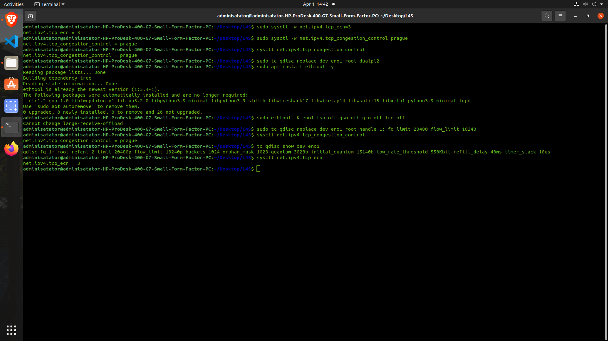

---

## **Step 5: Verify Configuration**
Run the following checks:

1. **Verify Congestion Control**  
   ```bash
   sysctl net.ipv4.tcp_congestion_control
   ```
2. **Check Queueing Discipline**  
   ```bash
   tc qdisc show dev eno1
   ```
3. **Confirm ECN Settings**  
   ```bash
   sysctl net.ipv4.tcp_ecn
   ```
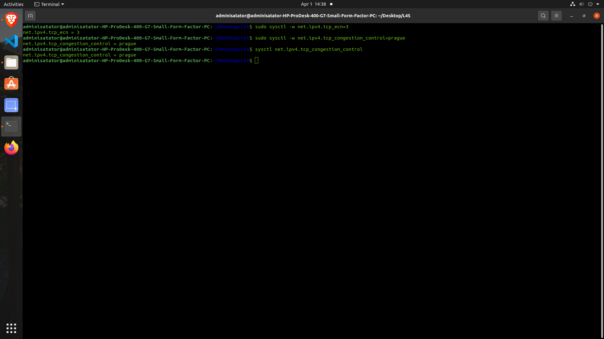
---

## **Step 6: Make Configuration Persistent**
To ensure settings persist after reboot:

### **6.1 Persist ECN & Prague TCP in `/etc/sysctl.conf`**
```bash
echo "net.ipv4.tcp_ecn=3" | sudo tee -a /etc/sysctl.conf
echo "net.ipv4.tcp_congestion_control=prague" | sudo tee -a /etc/sysctl.conf
```

### **6.2 Persist `tc qdisc` Setup**
Create a startup script `/etc/network/if-up.d/l4s_qdisc`:
```bash
sudo nano /etc/network/if-up.d/l4s_qdisc
```
Add:
```bash
#!/bin/sh
tc qdisc replace dev eno1 root dualpi2
```
Save and make it executable:
```bash
sudo chmod +x /etc/network/if-up.d/l4s_qdisc
```

### **6.3 Persist `ethtool` Settings**
Append to `/etc/rc.local`:
```bash
sudo nano /etc/rc.local
```
Add:
```bash
#!/bin/sh -e
ethtool -K eno1 tso off gso off gro off lro off
exit 0
```
Make it executable:
```bash
sudo chmod +x /etc/rc.local
```

---

## **Step 7: Perform Network Performance Experiments**
### **7.1 Install `iperf3`**
```bash
sudo apt install iperf3 -y
```

### **7.2 Run an `iperf3` Test**
Earlier, I tried running `iperf3` with an **incorrect server address format (`http://172.21.4.251:5201`)**.
Again you need to check your localhost from ifconfig -a.

 The correct method is:

- **On the Server Machine**  eg.(`172.21.4.251`):
  ```bash
  iperf3 -s
  ```
- **On the Client Machine**:
eg:
  ```bash
  iperf3 -c <server-ip> -p 5201
  ```
- **For Reverse Mode Testing** (Useful for NAT/firewall issues):
  ```bash
  iperf3 -c <server-ip> -p 5201 -R
  ```

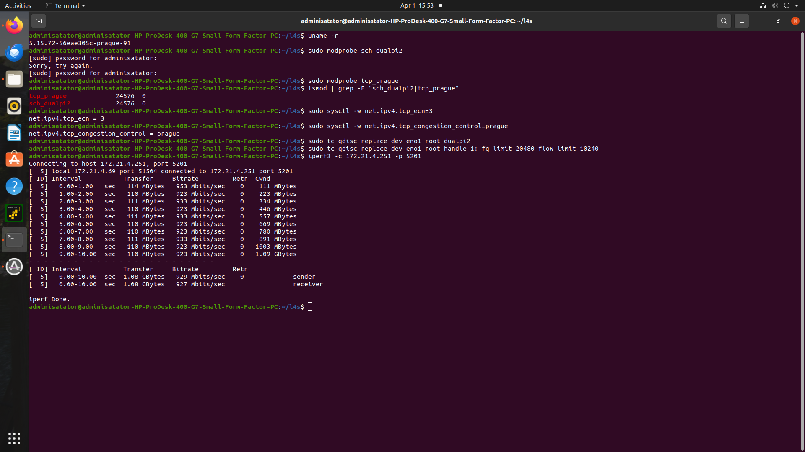
---

## **Step 8: Comprehensive TCP Prague Testing**

### **8.1 Basic TCP Prague Verification**
Verify that TCP Prague is available and selected as the congestion control algorithm:

```bash
# Check available congestion control algorithms
sysctl net.ipv4.tcp_available_congestion_control

# Confirm Prague is selected
sysctl net.ipv4.tcp_congestion_control
```

### **8.2 Testing TCP Prague Connection**
Run a controlled test between two L4S-enabled machines:

**On Server:**
```bash
iperf3 -s -V
```

**On Client with TCP Prague:**
```bash
iperf3 -c <server-ip> -t 30 -i 1 -V
```

`-V` provides verbose output.

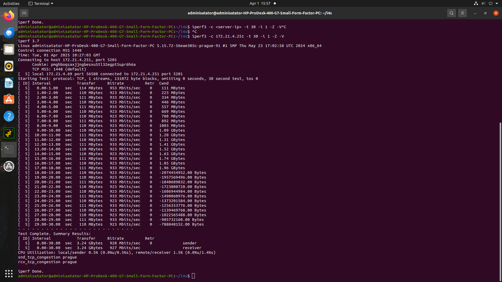

### **8.3 Comparing with Other Congestion Controls**
Run comparative tests with other congestion control algorithms:

```bash
# Run test with Cubic
iperf3 -c <server-ip> -t 30 -i 1 -C cubic

# Run test with BBR
iperf3 -c <server-ip> -t 30 -i 1 -C bbr

# Run test with Prague
iperf3 -c <server-ip> -t 30 -i 1
```
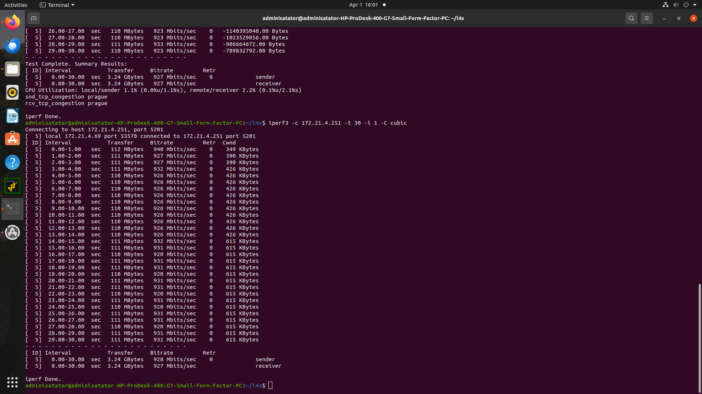


**Expected Difference:**
- L4S should show lower latency under congestion
- Similar throughput but fewer retransmits


### **8.4 TCP Prague Performance under Constrained Bandwidth**
Create bandwidth constraints to test Prague's behavior under congestion:

```bash
# On server side, create bandwidth limitation (e.g., 100 Mbps)
sudo tc qdisc replace dev eno1 root handle 1: tbf rate 100mbit burst 50kb latency 70ms

# Run test from client
iperf3 -c <server-ip> -t 60 -i 5 -V
```
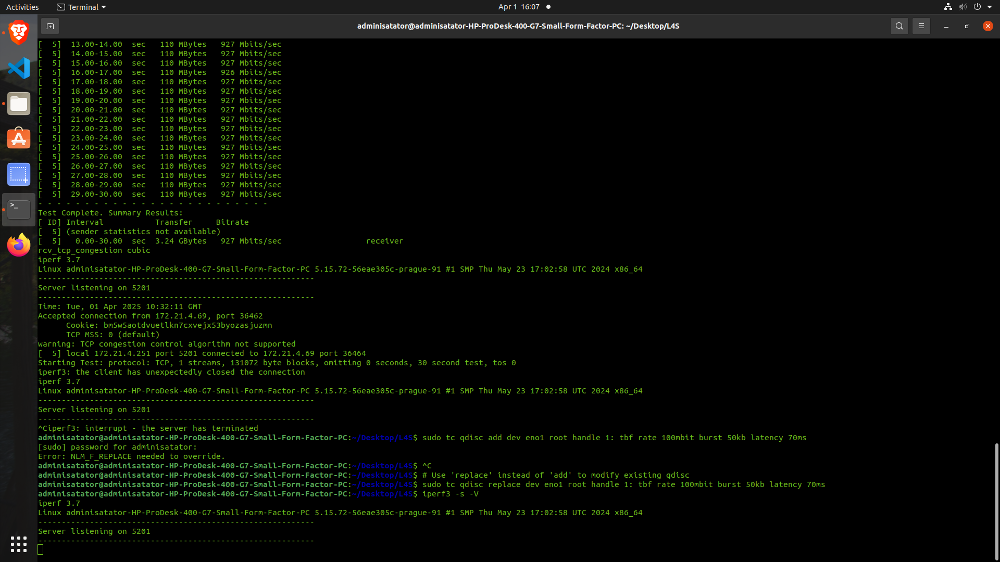

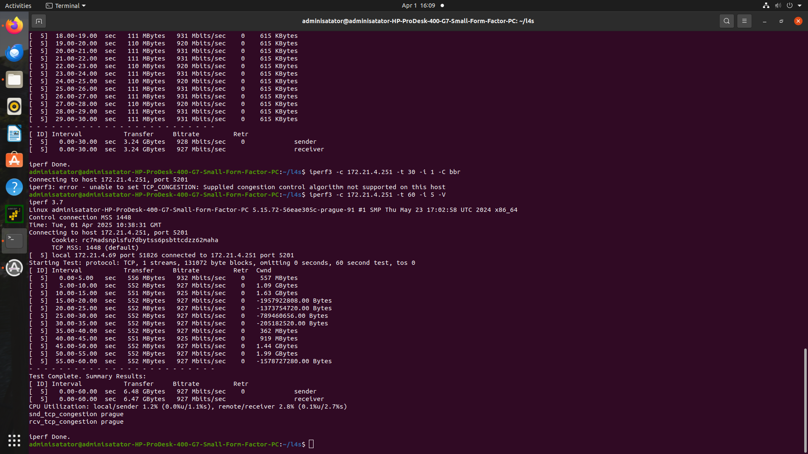


### **8.5 Monitoring ECN Marking with TCP Prague**
Monitor ECN marking during a TCP Prague transmission:

```bash
# Start continuous monitoring of TCP metrics
watch -n 1 'ss -tin | grep -i ecn'

# In another terminal, run iperf3 with Prague
iperf3 -c <server-ip> -t 60 
```
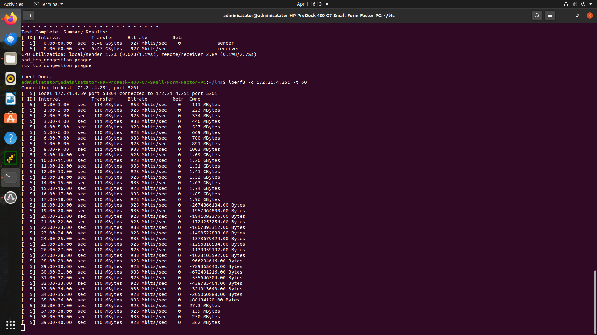

### **8.6 Testing TCP Prague Latency Under Load**
Test how TCP Prague maintains low latency under load:

**Start a background transfer:**
```bash
iperf3 -c <server-ip> -t 300 &
```

**While transfer is running, measure latency:**
```bash
ping -c 100 <server-ip>
```

Compare these ping results with the same test using cubic congestion control.

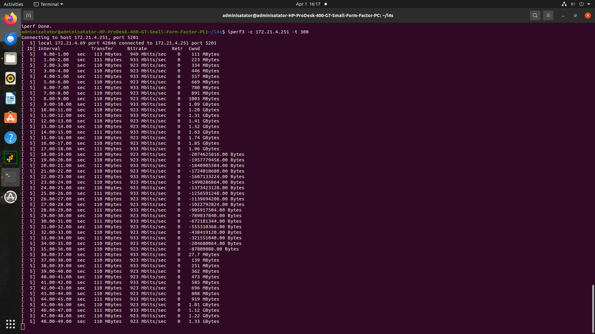

### **8.7 DualPI2 Queue Monitoring with TCP Prague**
Monitor the DualPI2 queue statistics during a TCP Prague transfer:

```bash
# Start TCP Prague transfer
iperf3 -c <server-ip> -t 120 &

# In another terminal, monitor the queue
watch -n 1 'tc -s qdisc show dev eno1'
```

This will show queue statistics including drops, marks, and backlog.

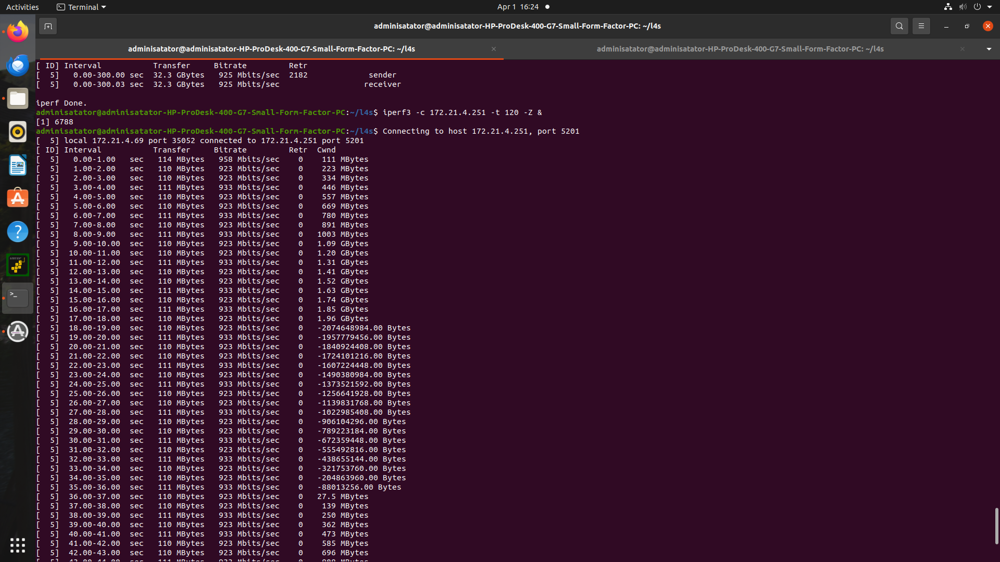

### **8.8 Long-Running Prague Stability Test**
Test the stability of TCP Prague over a longer duration:

```bash
iperf3 -c <server-ip> -t 1800 -i 30 -V
```

This runs a 30-minute test with output every 30 seconds to check for stability issues.

---

## **Step 9: Comprehensive L4S Verification Checklist**  
*Use this checklist to validate your L4S setup before experiments.*

### **1. Kernel Verification**
```bash
uname -r
```
✅ **Expected**: Kernel version contains `l4s` (e.g., `5.15.0-l4s+`).

### **2. Module Verification**
```bash
lsmod | grep -E "sch_dualpi2|tcp_prague"
```
✅ **Expected Output**:
```
tcp_prague             16384  0  
sch_dualpi2            16384  0
```

### **3. Network Stack Verification**
```bash
sysctl net.ipv4.tcp_ecn net.ipv4.tcp_congestion_control
```
✅ **Expected**:
```
net.ipv4.tcp_ecn = 3  
net.ipv4.tcp_congestion_control = prague
```

### **4. Queue Discipline Verification**
```bash
tc qdisc show dev eno1  # Replace with your interface
```
✅ **Expected**:  
`qdisc dualpi2 root refcnt 2 limit 1000p target 5ms ce_threshold 1ms`

### **5. Offload Verification**
```bash
ethtool -k eno1 | grep -E 'tso|gso|gro|lro'  # Replace interface
```
✅ **Expected**:
```
tcp-segmentation-offload: off  
generic-segmentation-offload: off  
generic-receive-offload: off  
large-receive-offload: off [fixed]
```

### **6. Functional Test**
**Server**:
```bash
iperf3 -s -p 5201
```
**Client**:
```bash
iperf3 -c [server_ip] -p 5201 -t 20 
```
✅ **Success Criteria**:  
- Stable throughput with no errors.  
- Verify ECN negotiation:  
  ```bash
  ss -tin | grep ecn  # Should show "ecn" in output
  ```

## **Step 10: Compile the Kernel from Source (Optional)**
If you prefer to compile the kernel instead of using the pre-built package:

1. **Clone the L4S Kernel Repository**
   ```bash
   git clone https://github.com/L4STeam/linux
   cd linux
   ```
2. **Configure the Kernel**
   ```bash
   cp /boot/config-$(uname -r) .config
   make olddefconfig
   scripts/config -m TCP_CONG_PRAGUE
   scripts/config -m NET_SCH_DUALPI2
   ```
3. **Compile & Install the Kernel**
   ```bash
   make -j$(nproc) LOCALVERSION=-prague-1
   sudo make modules_install
   sudo make install
   sudo update-grub
   ```
4. **Reboot into the New Kernel**
   ```bash
   sudo reboot
   ```

---

## **Final Notes & Troubleshooting**
- If your interface (`eno1`) isn't recognized, run:
  ```bash
  ip link show
  ```
- If `iperf3` fails to connect:
  - Check if the server is running:
    ```bash
    sudo netstat -tulnp | grep 5201
    ```
  - Ensure port `5201` is open:
    ```bash
    sudo ufw allow 5201/tcp
    ```
- For debugging network issues, use:
  ```bash
  dmesg | grep -i dualpi2
  ```

  | Symptom               | Checklist Step | Solution |  
|------------------------|----------------|----------|  
| `tcp_prague` not available | Step 9.2 | Load module: `sudo modprobe tcp_prague` |  
| ECN not enabled         | Step 9.3 | Set `net.ipv4.tcp_ecn=3` |  
| DualPI2 qdisc missing   | Step 9.4 | Reapply: `sudo tc qdisc replace dev eno1 root dualpi2` |  

---

### **Additional Notes**
- **Testing in a Controlled Environment**: Test the L4S setup in a controlled network environment to isolate variables and measure performance accurately.
- **Telehealth Applications**: For telehealth use cases (e.g., DICOM imaging, telemonitoring, and televisits), ensure the network is optimized for both high-throughput and low-latency traffic.
- **Documentation**:
1. L4S Team GitHub Repository: https://github.com/L4STeam/linux
2. RFC 9330 - L4S Architecture: https://datatracker.ietf.org/doc/rfc9330/
3. Prague Congestion Control Algorithm: https://datatracker.ietf.org/doc/draft-briscoe-iccrg-prague-congestion-control/
4. DualPI2 AQM Algorithm: https://datatracker.ietf.org/doc/draft-ietf-tsvwg-aqm-dualq-coupled/

---

This setup should allow you to experiment with L4S on a Linux system.


## **New: Connecting Two L4S-Configured Machines on Same Subnet**

### **Prerequisites for Two-Machine Setup**
1. Two machines with L4S kernel installed (follow Steps 1-5 above on both)
2. Connected via Ethernet or on same network subnet
3. IP addresses assigned (e.g., 192.168.1.10 and 192.168.1.20)

### **Step A: Verify Network Connectivity**
On both machines:
```bash
ip addr show
ping <other-machine-ip>  # e.g., ping 192.168.1.20
```

### **Step B: Configure iperf3 Server and Client**
**On Server Machine (192.168.1.10):**
```bash
iperf3 -s
```

**On Client Machine (192.168.1.20):**
```bash
iperf3 -c [server_ip] -t 60 -i 5
```

### **Expected Output Examples**

**1. Successful Connection:**
```
Connecting to host 192.168.1.10, port 5201
[  5] local 192.168.1.20 port 12345 connected to 192.168.1.10 port 5201
[ ID] Interval           Transfer     Bitrate         Retr
[  5]   0.00-5.00   sec  1.25 GBytes  2.15 Gbits/sec    0
[  5]   5.00-10.00  sec  1.30 GBytes  2.23 Gbits/sec    0
...
```

**2. With L4S Latency Measurements:**

```bash
iperf3 -c [server_ip] -t 30
```
Expected:
```
[ ID] Interval           Transfer     Bitrate         Retr  Cwnd
[  5]   0.00-1.00   sec   156 MBytes  1.31 Gbits/sec    0    350 KBytes
[  5]   1.00-2.00   sec   158 MBytes  1.33 Gbits/sec    0    420 KBytes
...
```

### **Verifying L4S Functionality**
1. Check ECN negotiation:
```bash
ss -tin
```
Look for `ecn` in output:
```
... ecn,cwr ...
```

2. Monitor DualPI2 queue:
```bash
tc -s qdisc show dev eno1
```
Expected:
```
qdisc dualpi2 ... 
 Sent 1250000 bytes 1000 pkt (dropped 0, overlimits 0)
```

---

## **Enhanced Troubleshooting for Two-Machine Setup**

### **Common Issues and Solutions**

1. **"Connection Refused" Error**
   - Verify server is running: `ss -tulnp | grep 5201`
   - Check firewall: `sudo ufw allow 5201/tcp`

2. **Subnet Mismatch**
   ```bash
   ip route show
   ```
   Ensure both machines show same network (e.g., `192.168.1.0/24`)

3. **ECN Not Negotiating**
   - Confirm on both machines:
   ```bash
   sysctl net.ipv4.tcp_ecn  # Should return 3
   ```

---


To perform DICOM files transfer test on L4S configurable server and client, refer to [DicomTransferTest.md](./DicomTransferTest.md)`